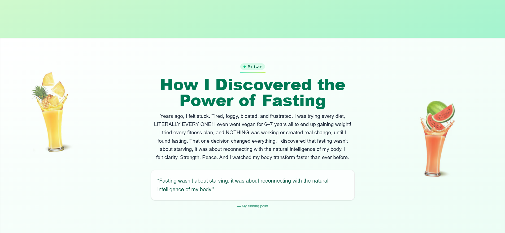
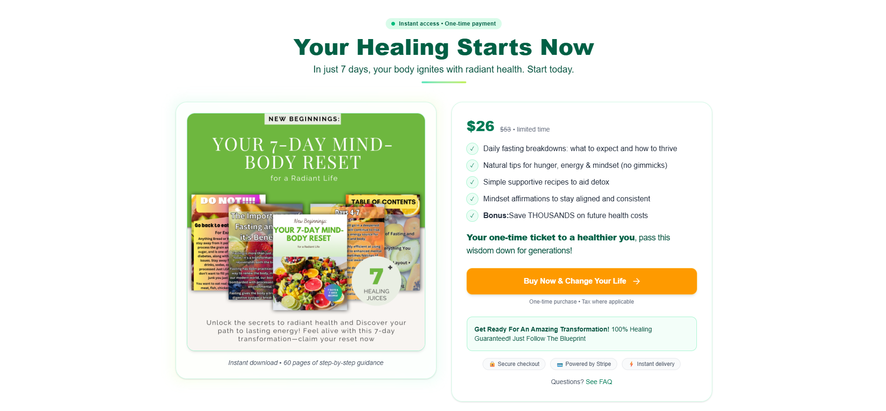

# Mind Body Reset — Next.js

A high-converting website rebuilt with **React + Next.js** and **Tailwind CSS**.

## Live Demo
https://mbr-next.vercel.app/

## Highlights
- App Router (Next.js), client + server components
- Smooth unlock flow, section jump, reduced-motion friendly animations
- Before/After slider with labels
- Premium purchase section (value stack, guarantee, trust badges)
- Accessible, responsive, mobile-first

## Tech
- Next.js, React
- Tailwind CSS
- lucide-react (icons)
- Deployed on Vercel


## Screenshots
**Hero & above-the-fold**  


**Purchase section**  



## Contact / Hire Me
- **LinkedIn:** https://www.linkedin.com/in/taylor-franco-982518140/
- **Email:** taylor.franco91@gmail.com
- **Portfolio:** https://taylor-franco-portfolio.netlify.app/

## Run locally
```bash
npm install
npm run dev
